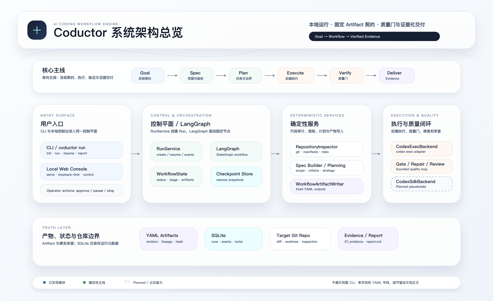
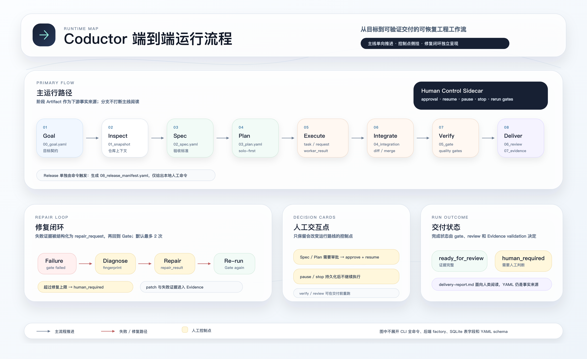
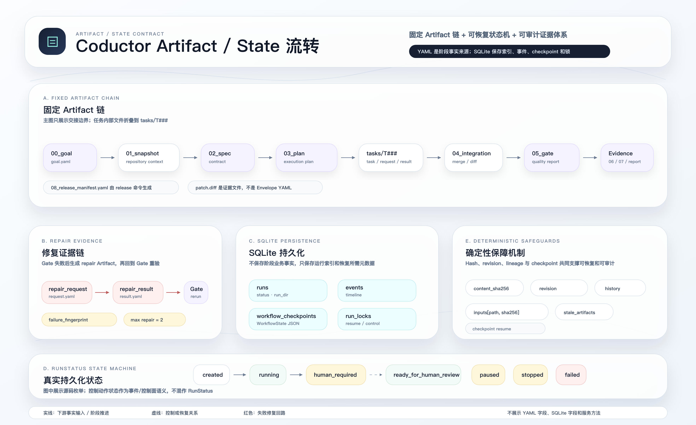

# Coductor

> Deterministic AI Coding Workflow Engine  
> From goal to verified change.

Coductor 是面向 AI Coding Agent 的确定性研发工作流引擎。它把一句自然语言研发目标，拆成可审计、可恢复、可验证的工程流程：模型负责理解、计划、编码与诊断；Coductor 负责阶段契约、质量门、Evidence、状态恢复和安全边界。

```text
Goal -> Inspect -> Spec -> Plan -> Execute -> Verify <-> Repair -> Review -> Evidence
```



## 目录

- [中文版本](#中文版本)
- [English Version](#english-version)

---

# 中文版本

## 一句话理解

Coductor 不是聊天客户端，也不是“多 Agent 数量展示器”。它更像一个本地研发流程控制台：每一步都落到固定 YAML Artifact，最终状态由质量门、独立审查和 Evidence Bundle 决定，而不是由某个 Agent 口头宣布完成。

## 当前完成度

| 模块 | 状态 | 说明 |
| --- | --- | --- |
| CLI 主流程 | 已实现 | `init`、`run`、`dry-run`、`resume`、`status`、`report`、`artifacts`、`logs`、`explain` |
| 本地 Web 控制台 | 已实现 | `coductor serve`，默认 `127.0.0.1:8765`，不需要额外 Web 运行依赖，不会替代 CLI 或固定 YAML Artifact |
| YAML Artifact 契约 | 已实现 | Envelope、hash、revision、lineage、history、stale 拦截、JSON Schema 生成 |
| LangGraph 编排 | 已实现 | 当前主 workflow 使用 contextual LangGraph，`compile_workflow_graph` 支持 checkpointer，目标依赖包含 `langgraph-checkpoint-sqlite` |
| 后端边界 | 已实现 | 默认真实路径为 `codex_exec`，离线测试用 `fake`，`codex_sdk` 保留为显式实验边界 |
| 执行策略 | 已实现 | Solo First、自动 pipeline、显式 parallel 审批、worktree 隔离并发与串行 patch 回放 |
| 质量闭环 | 已实现 | 质量门、失败指纹、最多 2 次修复循环、独立 Review、Evidence Bundle |
| 安全控制 | 已实现 | 默认关闭网络、Git push、PR、生产路径访问；控制命令有状态校验和 run lock |
| 发布交接 | 已实现基础版 | `release` 生成 release manifest；远程推送和 PR 创建仍默认关闭 |

## 适合解决什么问题

- 把“请修复这个功能并补测试”变成一条有产物、有质量门、有审查的可追溯流水线。
- 在本地项目中留下完整 Evidence，而不是只保留一段聊天记录。
- 让 `resume` 能从 checkpoint 和 Artifact 事实链恢复，并在上游内容变更时拒绝静默覆盖。
- 用 `fake` backend 离线验证流程，用 `codex_exec` 接入真实 Codex CLI。
- 在本地 Web 控制台里查看 run、Artifact、Timeline、Doctor，并执行受控的 approve / pause / stop / verify / review / release。

## 快速开始

建议把 Coductor 作为独立 CLI 工具安装，然后在任意目标项目里使用它：

```bash
pipx install -e /Users/ninex/Projects/hll-ecosystem/apps/coductor
coductor --help
coductor --version
```

`pipx install -e` 是 editable 安装。日常修改 Coductor 源码后通常不需要重装；如果改了依赖、入口脚本或 `pyproject.toml`，再执行：

```bash
pipx reinstall coductor
```

进入一个目标项目后：

```bash
cd /path/to/target-project
coductor init
coductor doctor
coductor run "修复示例函数并补充测试" --backend fake
coductor status <RUN_ID>
coductor artifacts <RUN_ID>
coductor logs <RUN_ID>
coductor explain <RUN_ID>
coductor report <RUN_ID>
```

一次稳定 fake backend demo 的关键结果通常长这样：

```text
状态: ready_for_human_review
Final status: ready_for_human_review
Required gates: 1/1 passed
Evidence validation: valid
```

## 常用命令

| 命令 | 用途 |
| --- | --- |
| `coductor init` | 在当前项目生成 `coductor.yaml` 和 `.coductor/` |
| `coductor doctor` | 检查配置、后端能力、安全默认值和质量门 |
| `coductor run "<goal>"` | 执行研发目标 |
| `coductor run "<goal>" --dry-run` | 只生成前置计划，不派发 Worker |
| `coductor resume <RUN_ID>` | 从 checkpoint 和 Artifact 链恢复 |
| `coductor status <RUN_ID>` | 查看 run 状态 |
| `coductor status <RUN_ID>` 的机器可读模式 | 输出结构化状态，包括 checkpoint 摘要 |
| `coductor artifacts <RUN_ID>` | 查看固定 YAML Artifact 列表 |
| `coductor logs <RUN_ID>` | 查看 SQLite event timeline |
| `coductor logs <RUN_ID>` 的阶段过滤和机器可读模式 | 过滤阶段日志并输出结构化事件 |
| `coductor explain <RUN_ID>` | 解释当前阶段、错误、stale Artifact 和下一步 |
| `coductor verify <RUN_ID>` | 真实重跑质量门并更新 `05_gate_report.yaml` |
| `coductor review <RUN_ID>` | 重跑独立审查和 Evidence 交付 |
| `coductor approve <RUN_ID>` | 批准需要人工审批的 spec 或 parallel plan |
| `coductor pause <RUN_ID>` / `coductor stop <RUN_ID>` | 暂停或停止允许状态中的 run |
| `coductor release <RUN_ID>` | 生成 `08_release_manifest.yaml` |
| `coductor serve` | 启动本地 Web 控制台 |

## 本地 Web 控制台

```bash
cd /path/to/target-project
coductor serve
```

默认地址：

```text
http://127.0.0.1:8765
```

常用参数：

```bash
coductor serve --host 127.0.0.1 --port 8765 --open
coductor serve --host 0.0.0.0 --port 8765 --allow-lan
```

控制台提供四类核心视图：

- Overview：run 状态、阶段、控制动作和摘要。
- Artifacts：固定 YAML Artifact 列表与原文预览。
- Timeline：SQLite event timeline。
- Doctor：配置、后端能力、安全开关和质量门摘要。

安全默认值：

- 默认只监听 `127.0.0.1`；非 loopback host 必须显式传入 `--allow-lan`。
- Web API 不提供任意 shell，不默认开启联网、Git push、PR 创建或 Secrets 读取。
- Artifact 和日志预览限制在 run 目录内，拒绝路径穿越、绝对路径、软链接逃逸和不受支持的文件后缀。
- `approve`、`pause`、`stop`、`resume`、`verify`、`review`、`release` 复用 CLI/service 的状态校验、SQLite run lock 和 stale lock 策略。

## 运行产物

Coductor 的下游事实来源是固定 YAML Artifact，而不是自由文本。一次 run 会写入：

```text
.coductor/runs/<run-id>/
├── 00_goal.yaml
├── 01_repository_snapshot.yaml
├── 02_spec.yaml
├── 03_execution_plan.yaml
├── 04_integration.yaml
├── 05_gate_report.yaml
├── 06_review.yaml
├── 07_evidence.yaml
├── 08_release_manifest.yaml
├── delivery-report.md
├── contracts/
│   ├── contracts.yml
│   └── generated.schema.json
├── history/
├── logs/
├── repairs/
└── tasks/<task-id>/
    ├── task.yaml
    ├── worker_request.yaml
    ├── worker_result.yaml
    └── patch.diff
```

并非每个 run 都一定产生所有文件；例如未 release 的 run 不会有 `08_release_manifest.yaml`。

## Artifact 示例

```yaml
schema_version: "1.0"
artifact_type: execution_plan
status: validated
data:
  strategy: pipeline
  strategy_reasoning:
    - "目标包含明确的先后依赖信号"
  tasks:
    - id: T001
      task_type: contract_authoring
      role: builder
      depends_on: []
    - id: T002
      task_type: integrated_implementation
      role: builder
      depends_on:
        - T001
      allowed_paths:
        - "src/**"
        - "tests/**"
```

Artifact 规则：

- 写入时先写临时文件，再 rename。
- `metadata.content_sha256` 对规范 JSON 表示计算。
- 每次修订复制到 `history/`，revision 单调递增。
- `inputs` 记录上游 path、revision 和 sha256。
- `resume` 会校验 Artifact hash、revision 和 contract hash；发现 stale 时进入 `human_required`。

## 架构与执行流



核心边界：

- 确定性程序负责 Git、文件扫描、Schema 校验、质量门、权限、哈希和 run 状态。
- 模型负责语义理解、计划、编码、诊断与独立审查。
- SQLite 保存 run/event 索引和恢复入口。
- YAML Artifact 保存阶段交接事实。
- `RunService` 构建 contextual LangGraph；节点保持薄，真实阶段副作用由 artifact writer、task execution、verification、repair、review delivery 等服务层执行。

### Backend Boundary

`src/coductor/backends/factory.py` 负责后端选择：

- `codex_exec`：默认真实执行路径。
- `fake`：测试和离线 smoke 的确定性实现。
- `codex_sdk`：显式实验边界，不作为默认路径。

`CodexExecBackend` 使用 list-based `subprocess.run()`，prompt 通过 stdin 传入，命令形态为：

```bash
codex exec --sandbox <mode> --skip-git-repo-check -
```

Codex CLI 可以返回普通文本摘要；`worker_result.yaml`、`review.yaml`、`gate_report.yaml`、`evidence.yaml` 等固定结构文件始终由 Coductor 本地写入。

### 执行策略

- 默认 Solo First：能由一个 Codex Thread 完成的任务，不启动多个写代码 Worker。
- `auto` 检测明确先后依赖时生成顺序 pipeline。
- 显式 `parallel` 需要通过写路径冲突、依赖图、contract handoff 和验收覆盖检查，并默认要求人工审批。
- parallel 执行时，ready tasks 在隔离 git worktree 并发运行，主仓库只在批次完成后串行回放 patch。
- 修复循环默认最多 2 次；同一失败指纹重复或达到上限后进入 `human_required`。



## 项目结构

```text
src/coductor/
├── artifacts/      # YAML Artifact schema, hash, serializer, repository
├── backends/       # codex_exec, fake, codex_sdk boundary
├── config/         # coductor.yaml discovery and parsing
├── gates/          # quality gate runner and parsers
├── repository/     # repo inspection, git and worktree helpers
├── services/       # run, task execution, verification, repair, review, release
├── storage/        # SQLite run/event storage
├── web/            # dependency-light local console
└── workflow/       # contextual LangGraph, nodes, checkpoint, stage artifacts
```

更多文档：

- [Workflow](docs/workflow.md)
- [Architecture](docs/architecture.md)
- [YAML Contracts](docs/yaml-contracts.md)
- [Security](docs/security.md)
- [Architecture Diagrams](docs/architecture/README.md)

## 本地开发

```bash
python3.12 -m venv .venv
source .venv/bin/activate
pip install -e ".[dev]"
pytest -q
ruff check .
mypy src
```

生成 Schema：

```bash
python scripts/generate_schemas.py
```

建议提交前至少运行：

```bash
pytest -q
ruff check .
```

## 安全边界

Coductor 默认最小权限：

- Planner、Inspector、Reviewer 默认只读。
- Builder 和 Repairer 只允许 workspace-write。
- 网络、Git push、PR 创建和生产路径访问默认关闭。
- `.env*`、`**/secrets/**`、`**/production/**` 默认保护。
- 质量门命令来自配置或明确的人类输入，并使用 `shlex.split()` 执行。
- Evidence 必须包含通过的必需 Gate、无 blocking review 且存在 patch evidence，才允许进入 `ready_for_human_review`。

## Roadmap

已完成：

- Artifact lineage、revision、history、stale 检测。
- 前半段和后半段 Artifact 复用。
- `codex_exec` fallback、动态 pipeline、contract stale 检测。
- parallel 预检、人工审批、worktree 并发执行与串行 patch 回放。
- CLI 控制面、Web 控制台、真实 verify/review。
- duration/token usage 记录、Evidence hardening、demo E2E。
- run_dir 边界校验、敏感命令 redaction、local console 路径防逃逸。

后续重点：

- 通知审批。
- PR 创建。
- 更多 Backend。
- dispatch / repair 等执行型节点的幂等恢复扩展。

危险能力仍默认关闭：不自动推送远程分支，不自动创建 PR，不读取生产秘密，不自动合并。

---

# English Version

## What Is Coductor?

Coductor is a deterministic workflow engine for AI-assisted software changes. It turns a natural-language engineering goal into a local, auditable workflow with structured artifacts, quality gates, independent review, resume semantics, and an evidence bundle.

It is not a chat client. It is a control plane around coding agents.

## Highlights

| Area | Status | Notes |
| --- | --- | --- |
| CLI workflow | Shipped | `init`, `run`, `dry-run`, `resume`, `status`, `report`, `artifacts`, `logs`, `explain` |
| Local console | Shipped | `coductor serve`, loopback-first, no extra web runtime dependency |
| YAML contracts | Shipped | Envelope, hash, revision, lineage, history, stale checks, generated JSON Schemas |
| Orchestration | Shipped | contextual LangGraph with SQLite checkpoint support via `langgraph-checkpoint-sqlite` |
| Backends | Shipped | `codex_exec` as the default real backend, `fake` for offline smoke tests, `codex_sdk` as an explicit experiment |
| Execution strategy | Shipped | Solo First, auto pipeline, approved parallel execution through isolated worktrees |
| Verification loop | Shipped | Quality gates, failure fingerprints, bounded repair, independent review, Evidence Bundle |
| Safety | Shipped | Network, git push, PR creation, and production paths are disabled by default |

## Quick Start

Install Coductor once as an editable CLI tool:

```bash
pipx install -e /Users/ninex/Projects/hll-ecosystem/apps/coductor
coductor --help
coductor --version
```

Then use it inside any target repository:

```bash
cd /path/to/target-project
coductor init
coductor doctor
coductor run "fix the sample function and add tests" --backend fake
coductor status <RUN_ID>
coductor artifacts <RUN_ID>
coductor logs <RUN_ID>
coductor explain <RUN_ID>
coductor report <RUN_ID>
```

## Local Web Console

```bash
coductor serve
```

Default URL:

```text
http://127.0.0.1:8765
```

The console shows run overview, structured artifacts, event timeline, and doctor diagnostics. It reuses the same service-layer validation and locks as the CLI. It does not provide arbitrary shell execution and does not replace YAML artifacts as the downstream source of truth.

## Artifact Layout

```text
.coductor/runs/<run-id>/
├── 00_goal.yaml
├── 01_repository_snapshot.yaml
├── 02_spec.yaml
├── 03_execution_plan.yaml
├── 04_integration.yaml
├── 05_gate_report.yaml
├── 06_review.yaml
├── 07_evidence.yaml
├── delivery-report.md
├── contracts/
├── history/
├── logs/
├── repairs/
└── tasks/<task-id>/
```

Each stage reads upstream artifacts and writes the next fixed-structure YAML artifact. Resume validates hashes, revisions, and consumed contract hashes before continuing.

## Architecture

- Deterministic code handles Git, repository scanning, schema validation, quality gates, permissions, hashes, and run state.
- AI backends handle semantic reasoning, planning, implementation, repair diagnosis, and independent review.
- YAML artifacts are the handoff facts.
- SQLite stores run indexes, event indexes, locks, and checkpoint entry points.
- `RunService` builds the contextual LangGraph workflow; nodes stay thin and delegate side effects to service modules.

`CodexExecBackend` runs the Codex CLI through:

```bash
codex exec --sandbox <mode> --skip-git-repo-check -
```

The external CLI can return plain text. Coductor writes `worker_result.yaml`, `review.yaml`, `gate_report.yaml`, and `evidence.yaml` locally using its own schemas.

## Development

```bash
python3.12 -m venv .venv
source .venv/bin/activate
pip install -e ".[dev]"
pytest -q
ruff check .
mypy src
```

## Documentation

- [Workflow](docs/workflow.md)
- [Architecture](docs/architecture.md)
- [YAML Contracts](docs/yaml-contracts.md)
- [Security](docs/security.md)
- [Architecture Diagrams](docs/architecture/README.md)

## License

MIT
